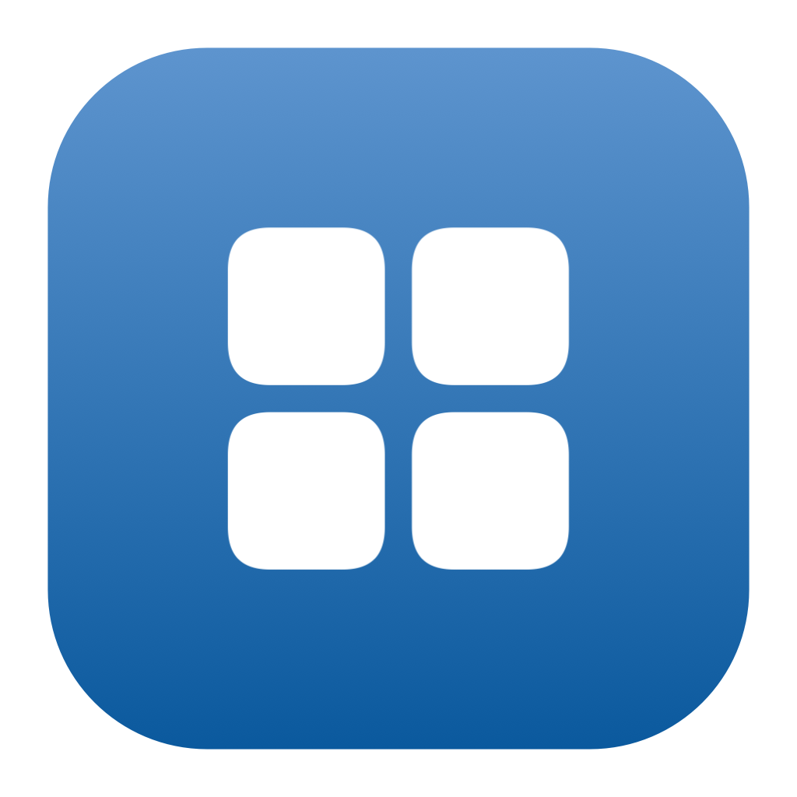
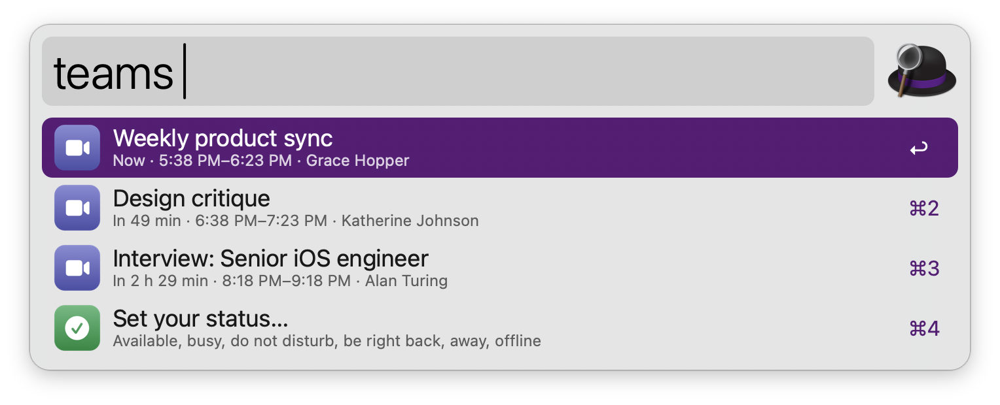
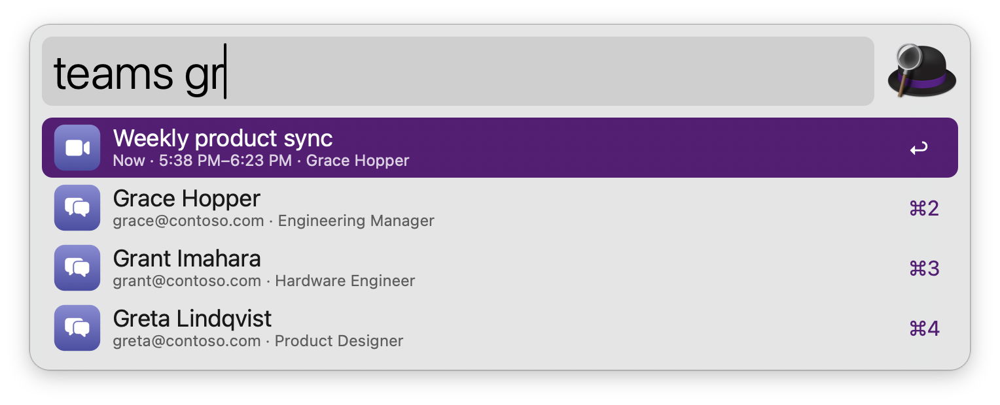
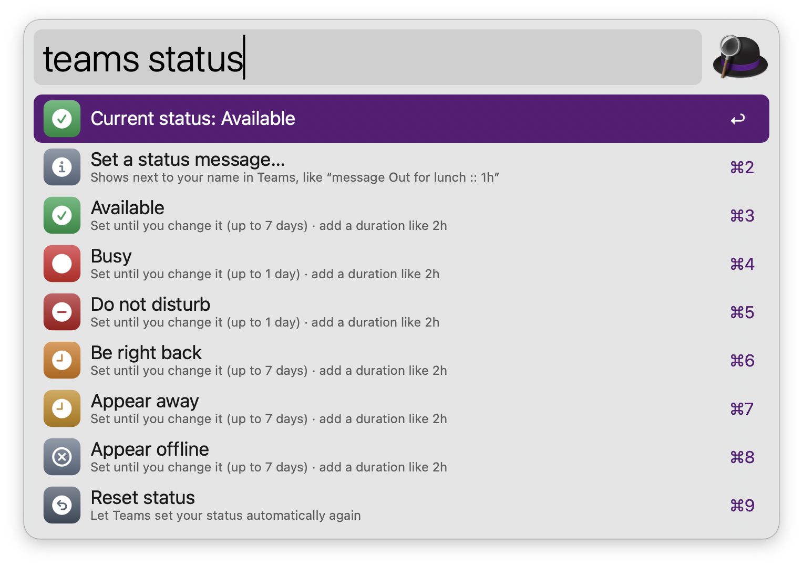
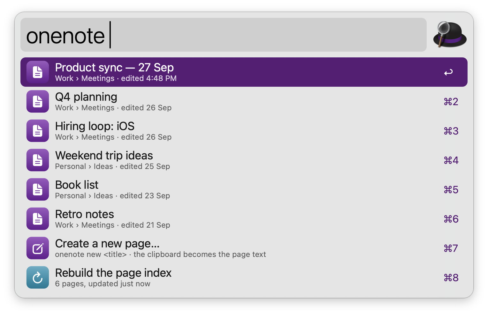
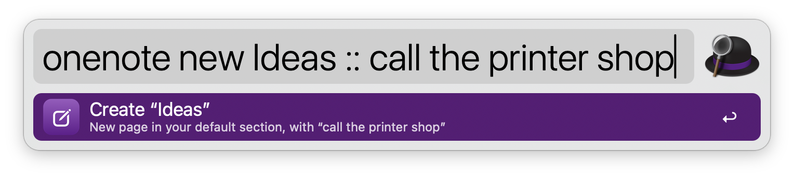
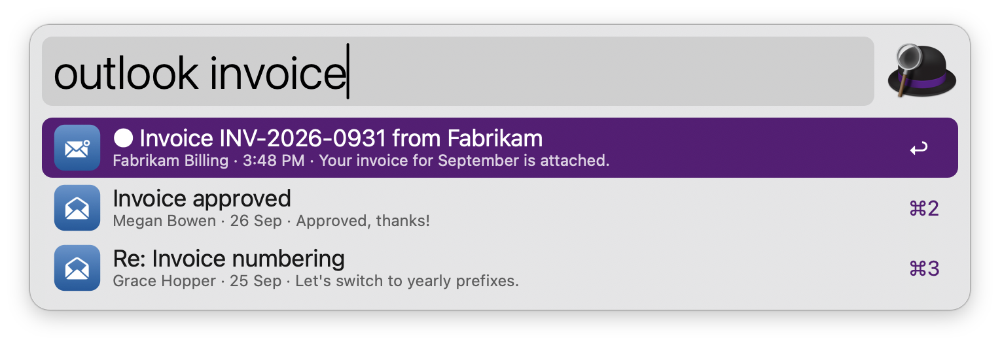

#  Microsoft 365

Join Teams meetings, set your Teams status, chat with people, search OneNote pages and Outlook mail, and see today’s agenda, through Microsoft Graph. No dependencies: everything runs on tools that ship with macOS.

## Setup

The workflow signs in with your own app registration, so no third party ever sees your data. Register it once (it takes about five minutes):

1. Open the [Microsoft Entra admin center](https://entra.microsoft.com) and go to **Entra ID** › **App registrations** › **New registration**. With a personal Microsoft account, use [the Azure portal’s App registrations](https://portal.azure.com/#view/Microsoft_AAD_RegisteredApps/ApplicationsListBlade) instead.
2. Name it (for example “Alfred”) and choose the **Supported account types**:
   * **Accounts in any organizational directory and personal Microsoft accounts** to use the tenant `common`.
   * **Accounts in this organizational directory only** to use your work or school tenant (you will need its **Directory (tenant) ID**).
   * **Personal Microsoft accounts only** to use the tenant `consumers`.
3. Leave **Redirect URI** empty and click **Register**.
4. Copy the **Application (client) ID** (and the **Directory (tenant) ID** for a single-tenant app) from the **Overview** page.
5. Open **Authentication**, set **Allow public client flows** to **Yes**, and click **Save**. Sign-in uses the device code flow, which needs this.
6. Open **API permissions** › **Add a permission** › **Microsoft Graph** › **Delegated permissions**, and add `User.Read`, `Calendars.Read`, `Mail.Read`, `Notes.ReadWrite`, `Presence.ReadWrite` and `People.Read`. If your organization doesn’t let users consent to apps, ask an admin to click **Grant admin consent**.
7. Enter the client ID and the tenant (`common` by default) in the Workflow’s Configuration.
8. Sign in via the `m365` keyword. Alfred copies a code and opens microsoft.com/devicelogin: paste the code, sign in, and accept the permissions. A notification confirms when you’re signed in.

Your sign-in stays in the macOS Keychain and renews itself. Teams status needs a work or school account: with the tenant `consumers` (personal accounts) the workflow doesn’t ask for `Presence.ReadWrite`.

## Usage

See today’s Teams meetings via the `teams` keyword, with the ones happening now first. Type to filter them by title or organizer, or to find people.



* <kbd>↩</kbd> Join the meeting in the Teams app (or the browser, set in the Workflow’s Configuration).
* <kbd>⌘</kbd><kbd>↩</kbd> Copy the join link.
* <kbd>⌥</kbd><kbd>↩</kbd> Open the event in Outlook.

Open a chat with someone by typing their name after the keyword.



* <kbd>↩</kbd> Open a chat with them in Teams.
* <kbd>⌘</kbd><kbd>↩</kbd> Copy their email address.
* <kbd>⌥</kbd><kbd>↩</kbd> Start a video call.

Set your Teams status with `teams status`, like `teams status busy`, `teams status dnd 2h` or `teams status reset`. Without a duration, Busy and Do not disturb last a day and the others seven days.



Search the titles of your OneNote pages across every notebook via the `onenote` keyword. Leave it empty for recently edited pages.



* <kbd>↩</kbd> Open the page in the OneNote app (or on the web, set in the Workflow’s Configuration).
* <kbd>⌘</kbd><kbd>↩</kbd> Open the page in OneNote on the web.
* <kbd>⌥</kbd><kbd>↩</kbd> Copy the web link.

Create a page with `onenote new` followed by its title. The clipboard becomes the page’s text, or type it after `::`, like `onenote new Ideas :: call the printer shop`. Pages go to your default section, or to the section set in the Workflow’s Configuration.



* <kbd>↩</kbd> Create the page.
* <kbd>⌘</kbd><kbd>↩</kbd> Create the page and open it.
* <kbd>⌥</kbd><kbd>↩</kbd> Create an empty page.

See today’s agenda via the `outlook` keyword, or type to search your mail. Search accepts Outlook’s syntax, like `from:anna` or `subject:invoice`.



* <kbd>↩</kbd> Open the event or message in Outlook on the web.
* <kbd>⌘</kbd><kbd>↩</kbd> Join an event’s online meeting, or copy a message’s sender address.

Sign in, sign out, or refresh cached data via the `m365` keyword.

Every keyword can be changed in the Workflow’s Configuration.

## Development

```bash
swift tools/make_icons.swift tools/icons.json src   # regenerate icons
python3 tools/build.py --package                     # write src/info.plist and dist/*.alfredworkflow
python3 tests/test_m365.py                           # run the tests (against a local mock of Microsoft's services)
```

## AI disclosure

This workflow was developed with the help of Claude (Anthropic), an AI assistant. The code is reviewed and tested by the author.
