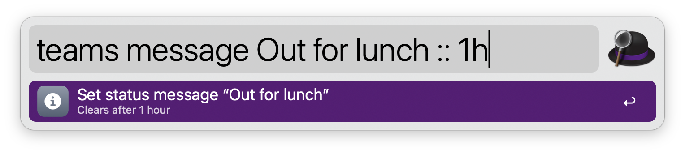
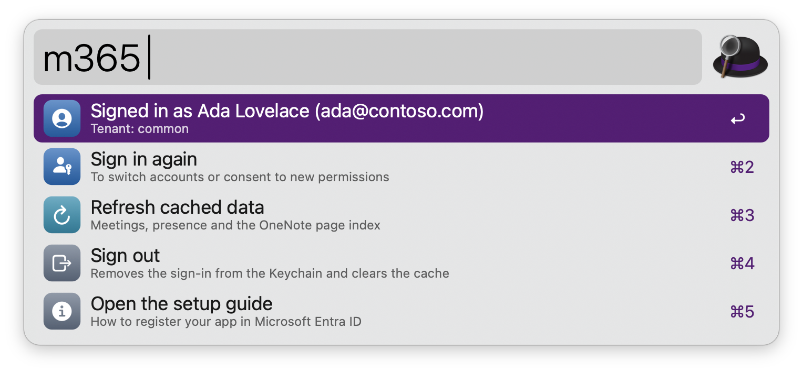

#  Microsoft 365

Join Teams meetings, set your Teams status, chat with people, search OneNote pages and Outlook mail, and see today’s agenda, through Microsoft Graph. No dependencies: everything runs on tools that ship with macOS.

## Setup

The workflow signs in with your own app registration, so no third party ever sees your data. Register it once (it takes about five minutes):

1. Open the [Microsoft Entra admin center](https://entra.microsoft.com) and go to **Entra ID** › **App registrations** › **New registration**. Microsoft no longer lets a personal Microsoft account register apps on its own: if you only have a personal account, first create a free Azure account (it comes with a directory), then register the app there. If your organization doesn’t let you register apps, ask an admin to register one for you and give you its client ID.
2. Name it (for example “Alfred”) and pick the **Supported account types** from the drop-down:
   * **Any Entra ID Tenant + Personal Microsoft accounts** to use the tenant `common`.
   * **Single tenant only** to use your work or school tenant (you will need its **Directory (tenant) ID**).
   * **Multiple Entra ID tenants** to use the tenant `organizations`.
   * **Personal accounts only** to use the tenant `consumers`.
3. Click **Register**. The workflow needs no redirect URI.
4. Copy the **Application (client) ID** (and the **Directory (tenant) ID** for a single-tenant app) from the **Overview** page.
5. Open **Authentication**, then its **Settings** tab, turn on **Allow public client flows** (older layouts show it under **Advanced settings** as **Yes**), and click **Save**. Sign-in uses the device code flow, which needs this.
6. Open **API permissions** › **Add a permission** › **Microsoft Graph** › **Delegated permissions**, and add `User.Read`, `Calendars.Read`, `Mail.Read`, `Notes.ReadWrite`, `Presence.ReadWrite` and `People.Read`. If your organization doesn’t let users consent to apps, ask an admin to click **Grant admin consent**.
7. Enter the client ID and the tenant (`common` by default) in the Workflow’s Configuration.
8. Sign in via the `m365` keyword. Alfred copies a code and opens microsoft.com/devicelogin: paste the code, sign in, and accept the permissions. A notification confirms when you’re signed in.

Your sign-in stays in the macOS Keychain and renews itself. Teams status needs a work or school account: with the tenant `consumers` (personal accounts) the workflow doesn’t ask for `Presence.ReadWrite`. The status you set only shows while you’re signed in to a Teams app.

If sign-in fails with a Conditional Access error, your organization blocks device code sign-in and only an admin can allow it for this app.

## Usage

See today’s Teams meetings via the `teams` keyword, with the ones happening now first. Meetings from other organizations count too when their join link is in the location or the start of the invitation. Type to filter them by title or organizer, or to find people.


* <kbd>↩</kbd> Join the meeting in the Teams app (or the browser, set in the Workflow’s Configuration).
* <kbd>⌘</kbd><kbd>↩</kbd> Copy the join link.
* <kbd>⌥</kbd><kbd>↩</kbd> Open the event in Outlook.

Open a chat with someone by typing their name or email address via the `teams` keyword.


* <kbd>↩</kbd> Open a chat with them in Teams.
* <kbd>⌘</kbd><kbd>↩</kbd> Copy their email address.
* <kbd>⌥</kbd><kbd>↩</kbd> Start a video call.
* <kbd>⌃</kbd><kbd>↩</kbd> Copy the link to your chat with them.

Set your Teams status, optionally for a while, like `status busy`, `status dnd 2h` or `status reset`, via the `teams` keyword. Without a duration, Busy and Do not disturb last a day and the others seven days.


Set the message shown next to your name in Teams, optionally clearing it after a while, like `message Out for lunch` or `message Back at 3 :: 2h`, via the `teams` keyword. Type `message` alone to see or clear the current one.



Search the titles of your OneNote pages across every notebook via the `onenote` keyword. Leave it empty for recently edited pages.


* <kbd>↩</kbd> Open the page in the OneNote app (or on the web, set in the Workflow’s Configuration).
* <kbd>⌘</kbd><kbd>↩</kbd> Open the page in OneNote on the web.
* <kbd>⌥</kbd><kbd>↩</kbd> Copy the web link.

Create a page by typing `new` and its title, like `new Ideas`, via the `onenote` keyword. The clipboard becomes the page’s text, or type it after `::`, like `new Ideas :: call the printer shop`. Pages go to your default section, or to the section set in the Workflow’s Configuration.


* <kbd>↩</kbd> Create the page.
* <kbd>⌘</kbd><kbd>↩</kbd> Create the page and open it.
* <kbd>⌥</kbd><kbd>↩</kbd> Create an empty page.

See today’s agenda via the `outlook` keyword, or type to search your mail. Search accepts Outlook’s syntax, like `from:anna` or `subject:invoice`.


* <kbd>↩</kbd> Open the event or message in Outlook on the web.
* <kbd>⌘</kbd><kbd>↩</kbd> Join an event’s online meeting (Teams, or a Zoom, Google Meet or Webex link in the location or invitation), or copy a message’s sender address.

Sign in, sign out, or refresh cached data via the `m365` keyword.



Every keyword can be changed in the Workflow’s Configuration.

## Development

```bash
swift tools/make_icons.swift tools/icons.json src   # regenerate icons
python3 tools/build.py --package                     # write src/info.plist and dist/*.alfredworkflow
python3 tests/test_m365.py                           # run the tests (against a local mock of Microsoft's services)
```

## AI disclosure

This workflow was developed with the help of Claude (Anthropic), an AI assistant. The code is reviewed and tested by the author.
